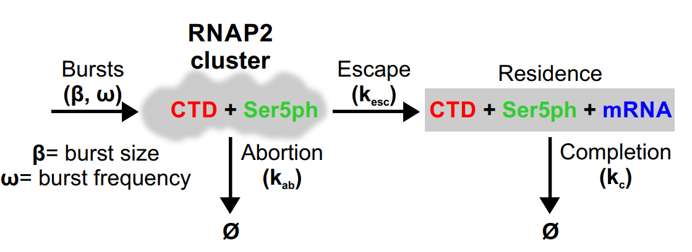

### Matlab Codes for Forero2020
-----
Repository for all modelling data and associated MATLAB codes for 
### Live-cell imaging reveals the spatiotemporal organization of endogenous RNA polymerase II phosphorylation at a single gene 
https://www.biorxiv.org/content/10.1101/2020.04.03.024414v1
[link to accepted paper]


--------



--------
## Data files
* ```./Data_files```
	* Nasc_TranscriptsCount - mRNA fish quant counts
	* Raw_Intensities Analysis-BLC_W_BG_RunAve_May18 - Correlation Data with running average
	* Raw_Intensities Analysis-BLC_W_BG_WO_RunAve_May18 - Raw Correlation Data
	* RawCorrelationsData - 6 correlations seperated into sheets
	* Renor_aligned_TPLData - aligned triptolide data
	* sub_1_min_data - Correlations from .15s frame rate movies
 
## Model Objects
```./Model_files```

* SimpleModel.m - Best fit (chosen) model object file
* TwoS_BurstingModel.m  - Two state bursting model
* RNAP_SER5_SplitModel.m - Phosphorylation model
* mRNAsoloModel.m - mRNA retention model
* GenericModel.m - generic model obj

## Model Fits
* ```./Model_fits```
	* Simple_MH_results
		* 3.17.2021 - Primary model fit and MCMC chains (Chains E) 

## GUI
* TranscriptionModel.mlapp

